> **Try the demo** — an interactive solver is embedded below the Results Preview. Pick from over 100 official LinkedIn puzzle and watch the model work through it with no backtracking.

# Intro

Unfortunately, I am an avid player of the LinkedIn games. My favorite among them is Queens (~480 day play streak). Queens is a logical constraint propagation game that is a bit like a combination of sudoku and the n queens problem. The game features an n x n grid of square cells (between 7 and 11). Each cell has an assigned color and across the whole puzzle there will be n total colors that form contiguous regions. The objective of the game is to place n "queens" down into cells such that there is a queen in every row, column, and colored region. In addition, there cannot be multiple queens in any row, column, or region, and queens may not be in diagonally adjacent cells. All official LinkedIn boards are crafted such that there is a single unique solution to the board. 

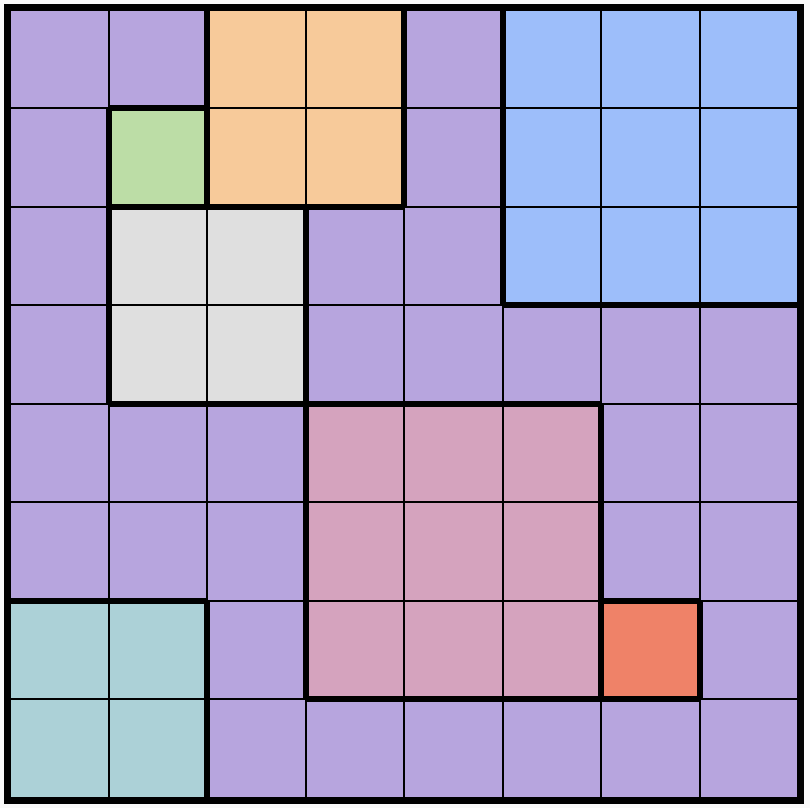
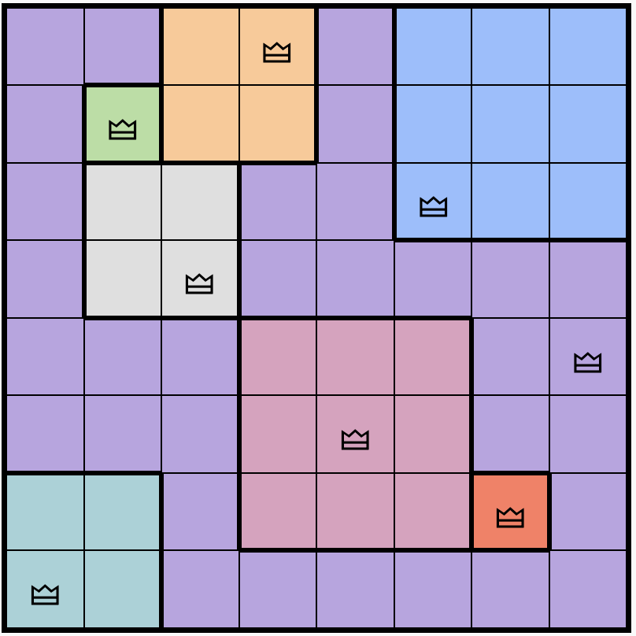

During my daily plays, I developed an interest to see if I could train a neural network to successfully play Queens. This article will document the process of developing this model and share the performance results. 

It is important to clarify what this project is and is not trying to accomplish. Queens is deterministically solvable so backtracking-based solvers are guaranteed to solve it, moreover with 49-121 cells, they do so extremely quickly. Accordingly, my goal was not to build something that solves Queens puzzles at a higher rate than a traditional solver, nor was it to develop something faster than a traditional solver. A backtracking algorithm with basic heuristics solves an average Queens puzzle in ~8-9 ms. Google OR-tools, a state of the art, industrial constraint propagation solver solves an average Queens puzzle in ~7-8 ms. Developing a sufficiently complex model to solve Queens with equivalent speed to the solvers mentioned would be unlikely (especially on CPU) as well as out of scope for this project. My goal was to explore whether a neural network could learn to solve Queens puzzles with a high success rate, relying on learned patterns rather than explicit constraint programming.

# Results Preview

The final model, a Hierarchical Reasoning Model built on graph neural networks, solves 100% of a held-out test set of 128 official LinkedIn puzzles and 99.9% of a larger validation set. While the graph structure encodes which cells are related by constraints, the model learns what to do with those relationships entirely from training data. Unlike traditional solvers that guess and backtrack (a basic backtracking solver averages about 1,000 guesses per puzzle), the model relies entirely on learned predictions and does not backtrack incorrect placements.

# Data

The first challenge was getting training data. LinkedIn does not provide an API for Queens puzzles, so I took screenshots of puzzles from my phone and extracted them programmatically. Generally only one puzzle is released per day but I was able to collect many puzzles rapidly from https://www.archivedqueens.com/ so thank you to them for their archiving work. Otherwise I expanded the set with a screenshot of the daily puzzle. Ultimately my seed set was 180 puzzles.

The extraction pipeline uses basic computer vision. For each screenshot, the code scans horizontal and vertical lines near the edges of the image, counting transitions from non-black to black pixels. These transitions correspond to grid lines, revealing the board dimensions (7x7 through 11x11). Once grid size is known, each cell's center region is sampled and averaged to get an RGB value. Similar colors are then clustered together using a distance threshold, producing an integer matrix where each value represents a region ID. The result is a clean representation of the puzzle: an n x n matrix of region labels.

# Augmentation and Synthetic Data Generation

To expand the dataset, I used two strategies: rotational augmentation and region mutation.

Rotational augmentation is straightforward. Each puzzle can be rotated 0, 90, 180, or 270 degrees to produce four equivalent puzzles. The solution rotates accordingly. This quadruples the dataset with no additional collection effort.

Region mutation is more involved. Starting from a solved puzzle, the algorithm randomly grows or shrinks region boundaries by reassigning cells to neighboring regions. Each individual mutation must maintain the contiguity of the regions, i.e. a new cell must not create separate regions of the same color.

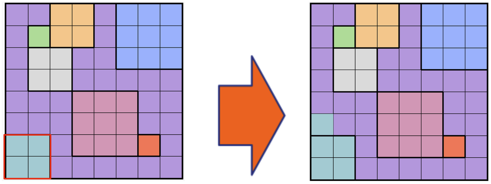

Prior to mutation beginning, I randomly set a difference threshold with bounds between 18% and 45%, and mutation ends when the child board is sufficiently different from its parent board (count of cells different from the parent divided by the total cell count). The difference bounds were set with empirical experimentation to ensure label boards between the parent and child were notably different. By the nature of Queens, we expect that these differences in label board ensure that there is little risk for memorization of a parent enabling solving of a child board. Additionally, I validate solvability and uniqueness by running an exhaustive solution counter, backtracking guarantees finding all solutions, so the counter stops early if it finds more than one and only boards with exactly one valid solution are accepted. Through this iterative mutation process, a single seed puzzle can spawn many children, each a valid Queens puzzle with its own solution. Once a parent provides a child board, I remove that parent from the set that is eligible for mutation and add the child board to the mutation eligible set in its stead.

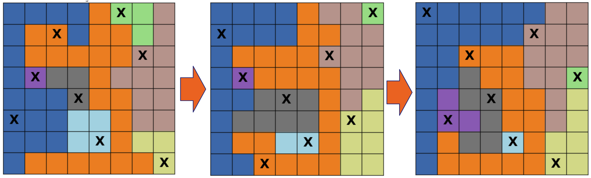

A Queens puzzle with n queens has n+1 meaningful board states: the empty board, then each intermediate state after placing 1, 2, ... n-1 queens, and finally the solved state. Each intermediate state presents a different prediction problem: given the current partial solution, which remaining cells are valid for the next queen? By decomposing each puzzle into its progressive states, 10,000 puzzles become roughly 350,000 training examples. This decomposition into states is also meaningful for how the model will function. Instead of taking in an empty puzzle as input and returning all queens in one pass, the model will take in a partially filled board and predict where the very next queen should go. This means when the model is used for inference it will be used autoregressively and the output of the last pass will be used as the input for the next pass. 

Some mind had to be paid to how to determine which queens are placed at which step of each puzzle in the training set. Ultimately, I settled on the simple approach of adding one queen to the partial board randomly from the possible labels but I did consider an alternative plan that would aim to mirror a more human-like solving approach. Though at every point in the Queens solving process, every positive label is equally viable, often certain cells are much more obvious to a human solver. For example in the puzzle below it is obvious that the green cell at (1,1) and the red cell at (6,6) are solution cells. After placing the (1,1) queen, it becomes obvious that cells (0,3) and (3,2) will also be queen cells because they are now the only cells in their respective region not constrained by the (1,1) queen. I could have ensured that the labels and then successive partial boards for the first 4 steps of pictured puzzle followed the mentioned route, but ultimately I elected that I did not want to bias the training process in this way and hypothesized that a fully random solving route in the training examples would still be sufficient to teach the rules and strategies of the game.

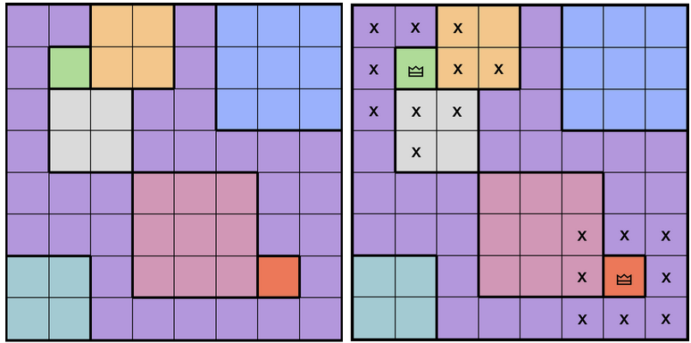

## Dataset Caveats

The test and validation sets used throughout this article are relatively small by ML standards (128 and 716 puzzles respectively). This is simply a constraint of the data source. Official LinkedIn puzzles are the strongest available test signal since they are hand-crafted and representative of the actual game, but they accumulate one per day. I needed my initial seed set for data generation and then used the daily trickle of new puzzles while I worked on this to form my test set. The synthetic puzzles generated through mutation provide training volume, but I wanted the final evaluation to reflect performance on real puzzles rather than on generated ones.

A related caveat: the validation set is the seed set of 180 puzzles augmented with rotations (one puzzle removed because of image corruption), which means synthetic children of those same puzzles exist in the training set. This is not ideal practice. The justification is that mutation produces children with materially different label layouts, as shown in the lineage visualizations above, making direct memorization from parent to child unlikely. The test set, drawn entirely from LinkedIn puzzles collected after the seed set, provides a cleaner signal, and the fact that test performance matches or exceeds validation performance suggests the val/train overlap is not causing meaningful contamination. That said, if the test set results had told a different story, this would have been the first thing to revisit. Both limitations are artifacts of the basic supply issue inherent with one puzzle a day.

# Feature Representation

Each cell in the board needs a feature vector for the model to process. The features I chose are minimal:

- Normalized row and column coordinates (2 floats between 0 and 1)
- One-hot encoded region ID (11 dimensions, supporting boards up to 11x11)
- Binary flag indicating whether a queen is already placed in this cell (1 dimension)

This gives 14 features per cell. The node features contain no explicit validity rules - the model must learn from training signal which placements are valid. The constraint relationships themselves are encoded in the graph edges, which we'll cover next.

# Why Graphs

Queens constraints have natural relational structure. A cell is invalid if it shares a row with an existing queen, shares a column, shares a region, or is diagonally adjacent. Each constraint type connects cells differently: rows and columns are linear, regions are irregular blobs, diagonal adjacency is purely local.

A CNN would need to infer these relationships from spatial position alone. A sequential transformer could learn the varied relationships, but this would demand significantly more parameters. A graph neural network can encode them explicitly as edges. The board becomes a graph with one node per cell and three edge types:

- Line constraint edges connect all cells in the same row or column
- Region constraint edges connect all cells in the same colored region
- Diagonal constraint edges connect diagonally adjacent cells

With constraints encoded in structure, the model can learn specialized attention for each relationship type rather than discovering the relationships themselves.

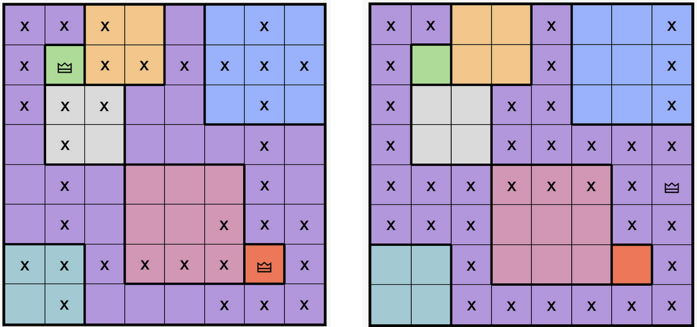

## Message Passing

Graph neural networks operate through message passing. Each node (cell) holds a feature vector, initially the 14-dimensional input described above. In a single message-passing step, every node collects the feature vectors of its neighbors, aggregates them (typically through a weighted sum), and uses the result to update its own representation. After one step, each node's representation encodes information about itself and its immediate neighbors. After two steps, it encodes its two-hop neighborhood, and so on.

The "attention" in Graph Attention Networks (GAT) refers to how this aggregation is weighted. Rather than treating all neighbors equally, the model learns attention coefficients that determine how much influence each neighbor's message has on the receiving node. For Queens, this means a cell can learn to attend strongly to neighbors that contain queens (which constrain it) and weakly to empty neighbors in the same row, or any other reasonable weighting reason.

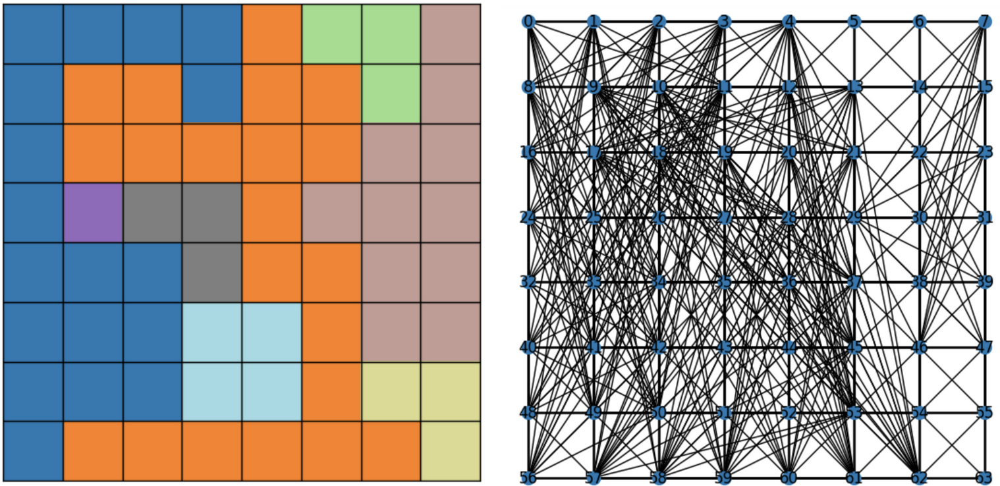

# Model Architecture: From GAT to HRM

The architecture evolved through three iterations, each addressing limitations discovered in the previous version. To understand why, it helps to categorize what makes queen placements easy or hard:

Type 1 placements are trivially invalid. The cell shares a row, column, region, or diagonal with an existing queen. These violations are local and immediate - a single message-passing step in a graph network can detect them.

Type 2 placements are locally legal but globally invalid. The cell satisfies all immediate constraints, but placing a queen there eliminates all valid options for some future queen. Detecting this requires reasoning about the entire board state. A simple example could be "if I place here, region 5 will have no remaining valid cells", but the interesting examples emerge from an ambiguous board state where a locally valid placement may not prove to make an unsolveable board state until several more queens are placed, so the model must learn to reason globally about how the current placement will impact future placements.

Type 3 placements are genuinely valid - part of the unique solution.

The core challenge is distinguishing Type 2 from Type 3. Both look identical from a local perspective. The model must develop global, consequential reasoning to see that a locally-legal placement leads to a dead end.

## GAT: Baseline Graph Attention

The first model used standard Graph Attention Networks (GAT) over a homogeneous graph. All constraint edges were merged into a single edge type, and the model learned attention-weighted message passing between connected cells.

This established the basic approach but treated all constraints identically. The model achieved 76% F1 on single-state prediction and solved only 45% of puzzles end-to-end. Error analysis showed failures distributed throughout the solve sequence, suggesting the model lacked the capacity to distinguish constraint types. A row constraint violation and a region constraint violation produce the same attention pattern, making it harder for the model to learn specialized reasoning for each.

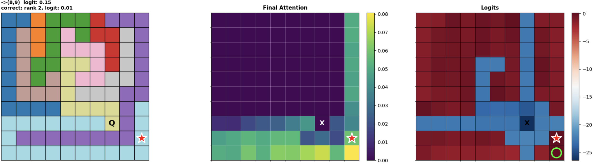

The above image shows a good example of a GAT failure. Note that this image shows the board,  placed queens so far (Q), and the next queen (star, red if wrong, green if right) on the left, the center shows an attention map relative to the cell with the placed queen, and the right shows an activation map with logits per cell. This pattern is repeated through later images. In the first pass the GAT has placed a correct queen at (7,7), but then in the second pass it places a queen at (8,9) which is a notably poor move as it causes an instantly unsolveable state that you do not even need to place more queens to see is unsolveable. The bottom row (row 9) is entirely light blue, thus we know that the queen in the light blue region MUST be in the bottom row to have a solveable state. My hypothesis is that without constraint-specific attention, the GAT struggles to differentiate some signal between the all blue row 9 and the mostly purple but slightly blue row 8, and thus fails to learn the critical pattern that the light blue queen must be placed in row 9 and the light blue sections of row 8 are off limits. In the adjoining attention visualization, the attention maps between row 8 and 9 appear similar outside of the cells removed for diagonal adjacency to the placed queen. Interestingly, cell (9,9), a correct placement, is heavily attended to and has the second highest logit but this is not sufficient to avoid the mistake.

## HeteroGAT: Constraint-Specific Attention

The baseline GAT treated all edges identically: a row neighbor and a region neighbor produced the same type of message. HeteroGAT changes this by introducing heterogeneous graph convolutions. Instead of merging all edges into a single type, the model maintains separate GAT layers for each edge type: one for line constraints, one for region constraints, one for diagonal constraints. Each layer learns its own attention weights, so message passing happens independently per constraint type. A cell receives one set of messages from its row and column neighbors, another from its region neighbors, and another from its diagonal neighbors. This separation means the model can develop distinct reasoning patterns for each constraint: attending to placed queens along line edges while attending to remaining open cells along region edges, for example.

The model also introduced HGT (Heterogeneous Graph Transformer) layers at intermediate depths. HGT is still an edge-based operation, with each node only receiving messages from its direct neighbors, but it uses type-aware attention that allows cross-constraint integration within a neighborhood. After the separate GAT layers process each edge type independently, HGT recombines them so that a node's line-constraint neighbors can influence how it attends to its region-constraint neighbors and vice versa. Empirical experimentation showed that this addition was beneficial, likely because it allows the model to integrate different constraint perspectives within each node's local neighborhood.

Performance improved substantially to 96% F1 and 91% full solve rate. But failures still concentrated in early steps (steps 0-2), exactly where global reasoning matters most. On an empty board, many cells satisfy all local constraints. The model must reason globally about which placements preserve solvability, and HeteroGAT's architecture doesn't explicitly separate local from global reasoning.

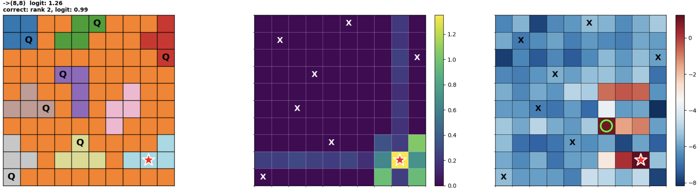

The above image shows a concise example of a situation that could lead to a failed placement by the HeteroGAT model (despite not being a step 0 error). There are three queens left to place and columns 6-8 need to be filled. The final 3 queens are such that multi step reasoning must be applied to ensure they all have a viable place. Placing the queen at (8,8) is a Type 2 error because it leaves no space for the orange queen that won't conflict with rows 3 or 5 or block off the pink region entirely. The model's next placement, at (4,6), or equivalently (6,5), the only other orange option, leaves the pink region fully blocked and the puzzle unsolveable. The light blue queen needed to go in (8,7) so that column 7 is left open for orange and the pink queen can go in (6,6). My hypothesis is that to resolve these kinds of errors the model needs better access to the global board state and a stronger ability to consider the consequences of a placement across multiple future steps, which is exactly what the HRM architecture provides. Technically, through multiple rounds of message passing, the HeteroGAT could propagate global information across the board, but it appears that message passing with only edge based attention is not sufficient to learn the kind of global, consequential reasoning needed to resolve complex Type 2 placements.

## HRM: Hierarchical Reasoning Model

The HeteroGAT results pointed to a clear gap: the model needed a way to explicitly separate local constraint checking from global board-state reasoning, and to let those two modes of reasoning inform each other iteratively. This is what led me to the Hierarchical Reasoning Model (HRM), an architecture introduced by Wang et al. ([arXiv:2506.21734](https://arxiv.org/abs/2506.21734)) for deep multi-step reasoning tasks like Sudoku and maze solving.

The core insight of their paper is that standard recurrent networks suffer from premature convergence: hidden states settle toward fixed points, effectively stalling computation before the problem is solved. HRM addresses this by splitting processing into two modules operating at different timescales: a fast L-module that runs multiple steps per cycle, and a slower H-module that updates once per cycle. The L-module converges to a local equilibrium within each cycle, then the H-module shifts the global context, forcing the L-module to re-converge toward a different equilibrium in the next cycle. This generates a sequence of distinct, stable computations rather than one that plateaus.

This mapped directly to the problem I was seeing with HeteroGAT. Queens puzzles require exactly the kind of two-timescale reasoning HRM provides: fast local constraint propagation (does this cell conflict with a placed queen?) interleaved with slower global assessment (does placing here leave region 5 with no valid cells?). The L-module handles the former, the H-module handles the latter, and cycling between them lets the model build up the consequential reasoning needed to distinguish Type 2 from Type 3 placements.

The L-module (Local) handles constraint-level reasoning through message passing. Each invocation of the L-module runs two GAT convolutions over the heterogeneous edges followed by an HGT layer. The two GAT steps propagate constraint information along each edge type independently: line, region, and diagonal messages flow in parallel. The HGT layer that follows integrates information across constraint types within each node's neighborhood, allowing the model to combine what it learned from row/column neighbors with what it learned from region neighbors. This sequence, two rounds of constraint-specific message passing then one round of cross-constraint integration, constitutes a single micro-step. The L-module runs two micro-steps per cycle, giving local constraint information four GAT passes and two HGT passes to propagate and converge before global reasoning occurs.

The H-module (Hierarchical/Global) operates fundamentally differently. Rather than message passing along edges, it runs multi-head self-attention over all nodes simultaneously, allowing every cell to attend to every other cell regardless of graph connectivity. This is what gives it global reach: a cell in the top-left corner can directly attend to a cell in the bottom-right, something that would require many message-passing hops through the graph. The H-module aggregates the local representations produced by the L-module into a board-wide context, captures patterns that no local neighborhood can see, and writes its output back to each node.

Critically, the H-module conditions on the L-module's output and vice versa. Each module maintains a persistent state vector (z_L and z_H respectively) that carries information across cycles. At the start of each L-module step, the input is the sum of the embedded features, the current local state z_L, and the current global state z_H. This means the L-module's local reasoning is informed by whatever global patterns the H-module detected in the previous cycle. Similarly, the H-module receives the updated z_L after the L-module finishes, so its global reasoning reflects the latest local constraint information.

Three full cycles of this L-then-H iteration allow progressive refinement. In early cycles, the L-module detects immediate constraint violations (Type 1) while the H-module begins forming a coarse picture of the board state. In middle cycles, the H-module's global context helps the L-module identify cells that are locally legal but lead to dead ends (Type 2). By the final cycle, both modules have converged: local and global information have been repeatedly exchanged, and the model's confidence in each cell reflects both neighborhood constraints and board-wide implications.

This architecture directly addresses the Type 2 problem. Early placements require mostly global reasoning (many cells satisfy local constraints), while later placements are dominated by local constraint elimination (few valid options remain). The hierarchical iteration lets the model allocate reasoning appropriately.

My implementation departs from the original HRM in several ways. The most significant is the L-module: Wang et al. use the same transformer architecture for both modules, while I use heterogeneous graph convolutions in the L-module and a single-layer transformer in the H-module. This is a deliberate choice: the L-module's job is local constraint propagation, and graph convolutions are a natural fit for that since constraints are already encoded as edges. The H-module's job is global aggregation, and full self-attention (where every cell can attend to every other cell) is a natural fit for that. Using different architectures for modules with different roles felt more principled than using the same architecture for both.

The other differences are simplifications. The original HRM uses a one-step gradient approximation grounded in deep equilibrium theory to avoid backpropagating through all timesteps. My model is small enough (359K parameters, 3 cycles) that standard backpropagation through time is tractable, so I use it directly. I also omit their adaptive computation time mechanism (which learns to halt early on easier inputs) and their deep supervision strategy (which provides loss feedback at intermediate cycles). These are interesting ideas but added complexity that didn't seem necessary for the scale of problem I was working with. The result is a smaller and simpler model that borrows the core architectural insight, hierarchical two-timescale iteration, while adapting the internals to exploit graph structure.

The HRM achieved 99.5% F1 on single-state prediction and 97.9% solve rate in ablation conditions, improving to 99.9%+ with full training on the val set and a perfect 100% solve rate on the test set.

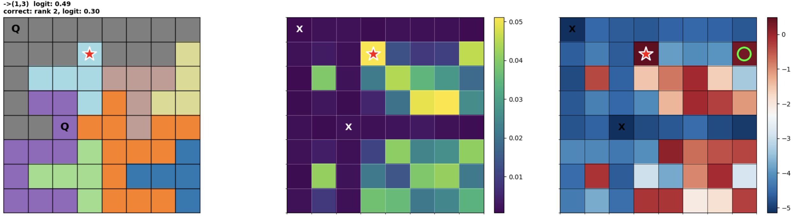

The above image shows the single HRM failure on the Validation set. Honestly this is simply a hard puzzle with an error made at the primary inflection point of the puzzle. At this point in the puzzle the model must place a queen at either (1,3) or (1,7) because they are the only options to cover row 1. As a human observer it is not clear which of the two is correct and solving this puzzle blind myself results in a bit of a guess here followed by backtracking if wrong. The puzzle is not architected in such a way to make the impact of this choice clear until several more queens are placed, so it is a good example of a puzzle that requires deep global reasoning to resolve the critical Type 2 placement. The model's logit for the incorrect (1,3) placement is 0.49, which is notably lower than its typical confidence for correct placements (median logit of 0.67 across all correct placements in the val set), suggesting genuine uncertainty; and notably, the correct cell (1,7) carries the second-highest logit, meaning the model nearly got it right. This is a case where perhaps adopting the adaptive computation time mechanism from the original HRM paper could have helped: if the model had the option to run an additional cycle of L/H iteration on this step, it might have been able to resolve the uncertainty and correctly place at (1,7). I will note I experimented with a hard coded 4 cycles instead of the 3 cycles I used and this led to heavily diminished performance setwide, so it is not as simple as "more cycles = better performance", but perhaps other work to stabilize the increased cycle count could yield improvements on puzzles like this that sit right at the edge of the model's reasoning capabilities.

# Training

The training objective is single-state prediction: given a board with some queens already placed, predict which remaining cells are valid for the next queen. Even though the model solves autoregressively at inference time (place queen, update state, predict again), training happens on individual states sampled from all stages of completion.

The model outputs a logit for every cell on the board, and the loss is computed per-cell as a binary classification, valid or invalid, using focal loss. This means the model is trained to produce a full validity map, not to point at a single cell. At inference time, the queen is placed at the cell with the highest logit. This framing has a useful property: the model develops calibrated confidence across the entire board, so even cells that aren't chosen as the maximum still carry meaningful signal about the board state.

The training signal is severely imbalanced. On a 9x9 board with 3 queens placed, only 6 remaining cells are valid. The other 72 unoccupied cells are invalid. Standard binary cross-entropy would let the model achieve low loss by predicting "invalid" everywhere. Focal loss addresses this by downweighting easy negatives and emphasizing hard positives, forcing the model to focus on the hard-to-classify Type 2 placements.

With 3 cycles of 2 micro-steps each, the L-module runs 6 rounds of graph convolutions. Over many rounds, node representations can aggregate so much neighborhood information that individual cell identity gets washed out: all nodes begin to look similar and the original input features become diluted. To counter this, the original embedded input is injected back into the working representation at the start of every L-block call. The first operation in each micro-step is a direct sum of the current local state, the current global state, and the raw cell embedding. This means no matter how many cycles have elapsed, each node always has direct access to its own coordinates, region ID, and queen flag before processing its neighbors. It keeps the model grounded in cell identity across the full depth of the computation.

Empty boards (state 0) present maximum ambiguity: many cells satisfy local constraints, so the model must rely on global reasoning. To address this, I generated an additional 10,000 state-0-only puzzles and concatenated them into the training set from the start. I initially experimented with introducing these examples mid-training as a supplementary dataset, but found that including them from epoch one produced better results: the model develops global reasoning capabilities earlier and more consistently when it sees empty boards throughout training rather than having them introduced as a curriculum shift.

Training runs for 18 epochs with AdamW optimization and cosine learning rate decay.

# Visualizations

The interactive demo above exposes two types of internal visualizations for the HRM model: activation maps and attention maps. These are available per reasoning cycle (Layers 1–3) and update at each step of the solve. They are not a rigorous window into the model's internal representations (activation norms are a coarse proxy and attention weights reflect learned routing, not necessarily human-interpretable reasoning), but they do offer a useful glimpse into the model in action.

**Activation maps** show the L2 norm of each cell's hidden state after the local graph convolution (L Activations) or after the global transformer (H Activations). High activation on a cell means that cell is producing a large representation at that layer, or is in some sense "lit up." In practice, the most consistent pattern is that cells which are directly constrained by placed queens tend to show elevated L activations, which makes sense: placed queens send messages along row, column, region, and diagonal edges, and their neighbors accumulate that signal. Watching L activations across cycles gives a rough picture of constraint propagation; early cycles show activation spreading outward from placed queens, later cycles show it converging toward the candidate placement. This is the most legible connection between what the visualization shows and what the model is doing.

H activations tell a more interesting story across cycles. In early cycles, the H map tends to mirror the L map in shape but with partially reversed magnitudes: this is abundantly visible in the similar cross pattern around the placed queen in the L cycle activations and in the first H cycle activation in the image below.

Then in the later cycles, this structure dissolves into a more amorphous, diffuse map. The H-module has now received updated L representations across multiple rounds of exchange, with local and global information repeatedly combined, and its output reflects a more fully integrated view of the remaining board state. Rather than responding to the specific shape of queen placements, it is encoding something closer to a global summary of the solution space: which regions are still live, how constrained the remaining choices are, and where the model's confidence is settling. The result is less spatially legible but arguably more meaningful as a representation of overall board state that enables better global consequential reasoning.

**Attention maps** show where the H-module's global transformer is attending from the perspective of the placed cell — the queen just placed in that step. Concretely, the attention tensor produced by the H-module has shape [batch, heads, query cell, key cell]; the displayed map slices out the row corresponding to the placed cell and averages across heads, yielding a weight for every other cell on the board. High attention on a cell means the placed cell is strongly attending to it when building its contribution to the global context. Unlike activation maps, attention does not track constraint propagation and is not necessarily high near other placed queens. Instead it tends to highlight cells that the model finds globally informative from the placed cell's vantage point. The exact meaning is hard to decompose cleanly, interesting potential patterns to look out for include paying attention to other probable queens cells or attention maps that reflect patterns suggestive of making safe long term choices.

# Ablation Results

To validate that architectural choices matter, I trained all models under controlled conditions with comparable hyperparameter budgets:

| Model | Parameters | Single-State F1 | Full Solve Rate |
|-------|------------|-----------------|-----------------|
| GAT | 86K | 76.6% | 45.3% |
| HeteroGAT | 445K | 96.0% | 91.0% |
| HRM | 359K | 99.5% | 97.9% |
| Benchmark HRM | 446K | 92.9% | 81.5% |
| Benchmark Sequential | 1.2M | 91.4% | 82.2% |

The progression from GAT to HeteroGAT shows the value of constraint-specific attention. The jump from HeteroGAT to HRM shows the value of hierarchical local-global iteration.

The benchmark models are particularly informative. Benchmark HRM uses the same hierarchical L/H iteration pattern but replaces graph convolutions with standard transformer layers over a flattened board, making it the closest controlled comparison for the decision to use GNNs in the L-module. Benchmark Sequential is a simple stacked transformer without hierarchical structure. Both achieve around 82% solve rate despite the Sequential having over three times the parameters of HRM. The Benchmark HRM result is especially telling: it has more parameters than the HRM (446K vs 359K) and the same cycle structure, yet solves 16 percentage points fewer puzzles. The only architectural difference is graph convolutions versus transformers in the L-module. This suggests that for local constraint propagation, message passing along explicit constraint edges is substantially more effective than learning those relationships from position alone, confirming the design choice discussed earlier.

# Failure Statistics

The failure cases embedded in each model's section above illustrate what goes wrong for individual puzzles. Zooming out, aggregate statistics across all failed puzzles reveal consistent patterns in *when* and *how confidently* each model makes its first mistake. For each model, I tracked two things: the step at which the first incorrect placement occurs, and the logit confidence the model assigned to that incorrect placement.

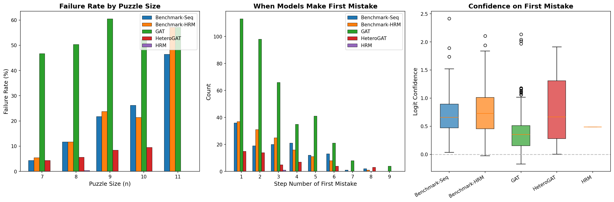

The GAT fails early and often: 46% solve rate on the validation set, median first-mistake step of 2, and low confidence on its errors (median logit 0.35). This is a model that struggles broadly. It cannot reliably distinguish constraint types, so errors are spread across the solve sequence and the model often "knows" it's uncertain.

The HeteroGAT fails less frequently (93% solve rate) and its errors shift later in the sequence (median first-mistake step of 2, but with a higher IQR ceiling). When it does fail, it tends to be more confident in its mistakes (median logit 0.67). This pattern makes sense: constraint-specific attention handles Type 1 violations well, so the model rarely fails on trivially constrained cells. Its failures come from Type 2 placements, cells that look locally legal but cause global contradictions, and the model's confidence reflects that these cells genuinely do satisfy all local constraints.

The benchmark models show an interesting split. Benchmark Sequential fails at a median step of 3 with moderate confidence (0.66). Benchmark HRM fails significantly earlier: median step 2 on the validation set, and median step 1 on the test set. It's worth noting that the benchmark HRM is a simplified implementation, not a faithful reproduction of the original HRM architecture. A more complete reproduction with deeper modules, proper training tricks, and more parameters would likely perform better. But that's partly the point: graph convolutions in the L-module appear to buy significant parameter efficiency for this problem. The constraint relationships that the transformer L-module must learn from position encodings are handed to the graph L-module for free via edges, which means the graph variant can achieve strong local reasoning with far fewer parameters.

The HRM fails on exactly one validation puzzle, at step 3 with a logit of 0.49, notably below its typical confidence for correct placements. The model is close to uncertain on the placement it gets wrong, which suggests it's near the boundary of what it can resolve rather than confidently incorrect.

# Solver Comparison

With the HRM solving 100% of test puzzles, I compared it against classical solvers to contextualize what that performance means. The solvers tested were naive backtracking, backtracking with AC-3 constraint propagation, and Google OR-Tools CP-SAT, a state-of-the-art industrial constraint solver. All were evaluated on the same 128 official LinkedIn test puzzles.

| Solver | Solve Rate | Avg Time | Avg Guesses | Avg Failed Guesses |
|--------|-----------|----------|-------------|-------------------|
| Backtracking | 100% | 3.80 ms | 997 | 988 |
| AC-3 | 100% | 14.13 ms | 454 | 446 |
| OR-Tools CP-SAT | 100% | 6.24 ms | 13 | 0.7 |
| Neural (HRM) | 100% | 87.99 ms | NA | NA |

OR-Tools is, unsurprisingly, very good at this. It solves every puzzle in about 6 ms with an average of 13 search decisions per puzzle, of which only about .7 is incorrect. Competing with it on raw speed is not realistic, and as discussed earlier, not the goal.

What is interesting is the qualitative difference in how the solvers operate. Every classical solver, including OR-Tools, operates through search: propose a candidate placement, propagate constraints, and if a contradiction is found, undo the placement and try something else. OR-Tools does this far more efficiently than naive backtracking (13 decisions vs 997), but the mechanism is the same: trial, evaluation, and revision. The neural model operates through direct inference. A single forward pass produces a confidence score for every cell, and the highest-scoring cell is placed. No candidates are proposed and rejected. No state is ever undone. The model never places a queen conditionally, committing based on learned pattern recognition, and if it's wrong, the puzzle is simply unsolvable. That it matches the solve rate of guaranteed solvers while operating through a fundamentally different mechanism is, to me, the most interesting result of this project.

# Additional Observations

1. Human Solving Patterns:
The HRM, despite being the best-performing model, appears to solve the puzzles in the least human like way. This is especially evident in easy puzzles. 

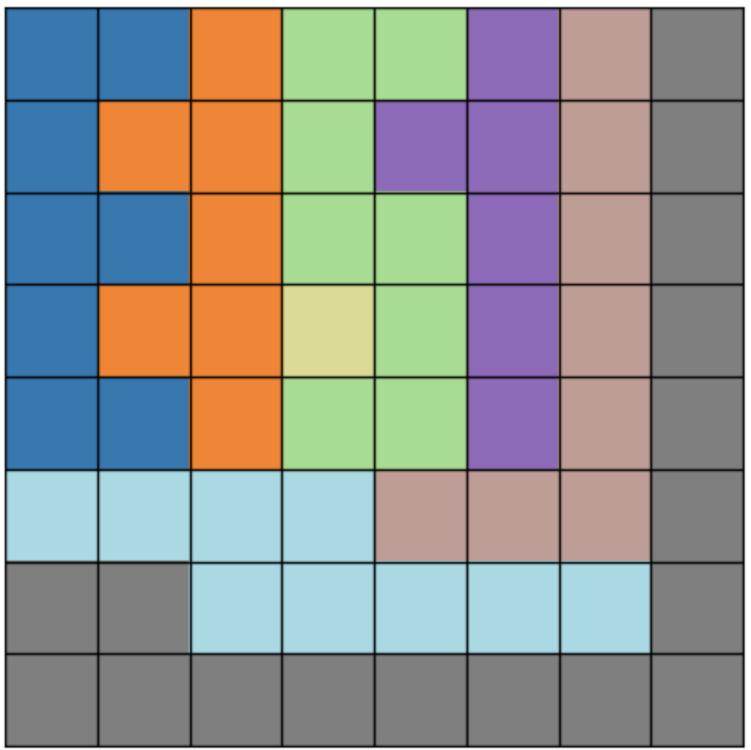

For example, in the pictured puzzle, a human solver would likely place the first queen at (3,3) as it is a single cell color region. The following queens are also trivial being some ordering of (7,7) because it is an intersection point of a column and row that are entirely one color, or (0,4) because the (3,3) queen eliminates all other options for the green region. The GAT and HeteroGAT both follow some combination of this order. The HRM, however, starts with (2,5), the second to last cell the HeteroGAT places (GAT gets this puzzle wrong after the initial sequence). This is a perfectly valid placement, but it is not the most obvious one and it is not the one a human would likely choose. Reviewing the attention and activations suggests that the HRM is actually aware of the leading placements that validate the (2,5) placement but over successive cycles it seems to converge to (2,5) as the most impactful placement of sorts. 

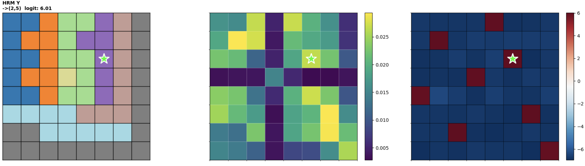

Referring to the image above, through the attention pattern (center) one can see that the HRM is very much aware of the impact of the single color region cell (3,3) on the board but opts for (2,5) instead. We can also see that the HRM is capable of one-shotting this puzzle, having already converged to all correct cells with high logits as seen in the activation on the right. 

2. Batch Placement

The one-shot behavior visible in the easy puzzle above raised an obvious question: if the model has already converged to correct high-confidence placements for multiple cells in a single forward pass, why place only one queen and run the full forward pass again? I implemented logit confidence-based batch placement: after each forward pass, rather than placing only the top cell, all cells whose logit exceeds a confidence threshold are placed simultaneously before the next pass.

The results were better than expected. On the 128 test puzzles, batch placement reduced the average number of forward passes from 8.1 to 1.1 with no change in solve rate, a 7x speedup. The model was already computing the right answer for multiple queens at once; batch placement just acts on that.

| Method | Solve Rate | Avg Forward Passes | Avg Time |
|--------|-----------|-------------------|----------|
| Single | 100% | 8.1 | 504 ms |
| Batch | 100% | 1.1 | 71 ms |

# Conclusion

Starting from 180 screenshots scraped off a phone app, the project arrives at a model that solves Queens entirely through learned pattern recognition, with no search, no backtracking, and no explicit constraint logic. It solves 100% of 128 held-out LinkedIn puzzles and 99.9% of a 716-puzzle validation set.

The three choices that drove those results are worth reflecting on. Graph structure let the model learn specialized constraint reasoning without needing to discover which cells are related from position alone. Hierarchical iteration separated local and global processing, giving the model a mechanism to reason through consequences rather than just checking immediate neighbors. And training on empty boards from the start ensured the model developed global reasoning early, rather than only learning to handle already-constrained states. Each of these shows clear measurable impact when ablated away.

The model is not faster than traditional solvers, roughly 88ms per puzzle versus 4-8ms for classical approaches. But speed was never the goal. The goal was to see whether a neural network could learn to play Queens through pattern recognition alone.

# Appendix

## Solver Comparison: Validation Set

The main solver comparison uses the 128-puzzle test set. Results on the 716-puzzle validation set (each puzzle augmented with 4 rotations) are shown below. The neural model's single failure on the val set is visible here.

| Solver | Solve Rate | Avg Time | Avg Guesses | Avg Failed Guesses |
|--------|-----------|----------|-------------|-------------------|
| Backtracking | 100% | 9.61 ms | 2319 | 2310 |
| AC-3 | 100% | 39.93 ms | 1057 | 1049 |
| OR-Tools CP-SAT | 100% | 7.39 ms | 4.7 | 0.2 |
| Neural (HRM) | 99.9% | 99.49 ms | NA | NA |

## Failure Statistics: Test Set

The failure statistics section discusses val set patterns. Test set results (128 official LinkedIn puzzles) are shown below. HRM achieves 100% on the test set and has no failure statistics to report.

| Model | Accuracy | First Mistake Step (Median [IQR]) | First Mistake Logit (Median [IQR]) |
|-------|----------|----------------------------------|-----------------------------------|
| GAT | 59.4% (76/128) | 2.0 [1.0, 4.0] | 0.26 [0.03, 0.47] |
| HeteroGAT | 95.3% (122/128) | 3.5 [2.2, 4.0] | 0.36 [0.26, 0.80] |
| Benchmark HRM | 85.2% (109/128) | 1.0 [1.0, 3.5] | 0.61 [0.49, 0.93] |
| Benchmark Sequential | 88.3% (113/128) | 4.0 [2.0, 5.0] | 0.70 [0.64, 0.89] |
| HRM | 100% (128/128) | n/a | n/a |

## Puzzle Size Distribution

| Size | Test Count | Test % | Val Count | Val % |
|------|-----------|--------|-----------|-------|
| 7x7 | 33 | 25.8% | 92 | 12.8% |
| 8x8 | 54 | 42.2% | 264 | 36.9% |
| 9x9 | 35 | 27.3% | 248 | 34.6% |
| 10x10 | 4 | 3.1% | 84 | 11.7% |
| 11x11 | 2 | 1.6% | 28 | 3.9% |
| Total | 128 | | 716 | |
